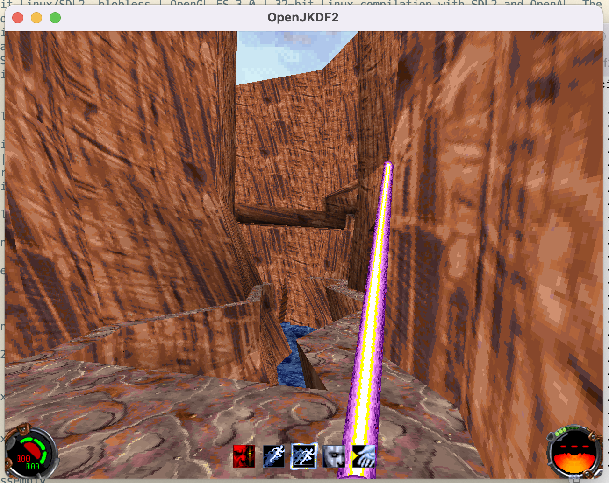

# OpenJKDF2



## [Latest Releases](https://github.com/shinyquagsire23/OpenJKDF2/releases) | [Report a crash or bug](https://github.com/shinyquagsire23/OpenJKDF2/issues)

OpenJKDF2 is a function-by-function reimplementation of DF2 in C, with 64-bit ports to MacOS and Linux. Files are organized as closely to the original game as possible, based on symbols from the Grim Fandango Remaster Android/Linux/macOS port, as well as scattered assertions from various other games. It also contains the original versions of `byacc` and `flex` used for COG script parsing.

OpenJKDF2 does *not* include any original game assets; a valid copy of JKDF2 is *required* and can be purchased from [GOG](https://www.gog.com/game/star_wars_jedi_knight_dark_forces_ii) or [Steam](https://store.steampowered.com/app/32380/STAR_WARS_Jedi_Knight_Dark_Forces_II/). The GOG version is recommended, since it is DRM-free and also includes the soundtrack in Ogg Vorbis format. If you'd like to try before you buy, a WebAssembly demo of OpenJKDF2 can be found at https://maxthomas.dev/openjkdf2/.

Support for playing the original soundtrack from Ogg Vorbis files is primarily supported for the GOG and Steam versions of the game assets. Original disk soundtracks can also be loaded from `MUSIC/1/Track<1..11>.ogg` and `MUSIC/2/Track<1..11>.ogg` for each disk's soundtrack. If files are missing, it will instead attempt to use a GOG track number from `MUSIC/Track<12..32>.ogg`. Dumping the soundtrack from disks at install time is planned for a future release of OpenJKDF2, but is not currently implemented.

## Platforms
OpenJKDF2 supports the following configurations:

| Configuration | Renderer | Description |
| --- | --- | --- |
| 64-bit Windows/SDL2 | OpenGL 3.3 | 64-bit Windows compilation with SDL2 and OpenAL. DirectX dependencies are replaced with SDL2 and OpenAL. |
| MacOS x86_64/AArch64 | OpenGL 3.3 | 64-bit MacOS compilation with SDL2 and OpenAL. All release packages include both Intel and ARM64. |
| 64-bit Linux/SDL2 | OpenGL 3.3 | 64-bit Linux compilation with SDL2 and OpenAL. |
| Emscripten/WebAssembly | WebGL 2/OpenGL ES 3 | WebAssembly with SDL2 and OpenAL. Runs in a web browser. Since WASM only supports 32-bit pointers, this will likely be less buggy than 64-bit, but less performant. |
| x86 Linux/SDL2, mmap blobs | OpenGL 3.3 | 32-bit Linux compilation with SDL2 and OpenAL. JK.EXE is memory mapped into the process and used as a "binary blob"; Unimplemented functions will fall back to JK.EXE implementations. |
| 32-bit Linux/SDL2, blobless | OpenGL 3.3 | 32-bit Linux compilation with SDL2 and OpenAL. The output executable is a swap-in replacement for JK.EXE, but will be missing functions and will crash on reaching unimplemented code. |
| x86 Win32/MinGW DLL | Software/DirectX | Win32 hooked build, JK.EXE is patched to load `df2_reimpl.dll` execute `hook_init_win` before JK.EXE's `main` function. Unimplemented functions will fall back to JK.EXE implementations. `df2_reimpl_kvm.dll` is used for the KVM target |

The following implementations are in-progress or planned:

| Configuration | Renderer | Description |
| --- | --- | --- |
| Android | OpenGL ES 3 | Not a huge priority, but would be nice to have. |
| iOS | Metal? | Not a huge priority, but would be nice to have. |
| Switch libnx | OpenGL ES 3 | Not a huge priority, but would be nice to have. |
| 32-bit Windows/SDL2 | OpenGL 3.3 | Windows compilation with SDL2 and OpenAL. DirectX dependencies are replaced with SDL2 and OpenAL. Unimplemented functions use JK.EXE as a binary blob? |

Linux building works on AArch64/RPi4 with llvmpipe, but V3D GLES has trouble with palettes.

OpenJKDF2 requires game data from a licensed copy of Jedi Knight: Dark Forces II in order to run; No game assets are provided by OpenJKDF2. On Linux, paths and filenames may be case-sensitive. Your directory structure should look something like this:
```
.
├── JK.EXE
├── MUSIC
│   ├── Track12.ogg
│   ├── Track13.ogg
│   ├── Track14.ogg
│   ├── Track15.ogg
│   ├── Track16.ogg
│   ├── Track17.ogg
│   ├── Track18.ogg
│   ├── Track22.ogg
│   ├── Track23.ogg
│   ├── Track24.ogg
│   ├── Track25.ogg
│   ├── Track26.ogg
│   ├── Track27.ogg
│   ├── Track28.ogg
│   ├── Track29.ogg
│   ├── Track30.ogg
│   ├── Track31.ogg
│   └── Track32.ogg
├── episode
│   ├── JK1.gob
│   ├── JK1CTF.gob
│   └── JK1MP.gob
├── openjkdf2-64
├── player
└── resource
    ├── Res1hi.gob
    ├── Res2.gob
    ├── jk_.cd
    └── video
        ├── 01-02A.SMK
        ├── 03-04A.SMK
        ├── 06A.SMK
        ├── 08-10A.SMK
        ├── 12A.SMK
        ├── 16A.SMK
        ├── 18-19A.SMK
        ├── 21A.SMK
        ├── 23A.SMK
        ├── 25A.SMK
        ├── 27A.SMK
        ├── 33-34A.SMK
        ├── 36A.SMK
        ├── 38A.SMK
        ├── 39A.SMK
        ├── 41-42A.SMK
        ├── 41DA.SMK
        ├── 41DSA.SMK
        ├── 44A.SMK
        ├── 46A.SMK
        ├── 48A.SMK
        ├── 50A.SMK
        ├── 52-53A.SMK
        ├── 54A.SMK
        └── 57A.SMK
```

When running on SDL2-based builds (Linux/MacOS/Win64), be sure to have copied the GLSL shaders from `resource/shaders/*` to `<JK.EXE base folder>/resource/shaders/*`, as shown above.

## Building

See [here](BUILDING.md) for instructions.

## TL;DR: What Isn't Implemented, Yet
 - Joystick menu in Setup > Controls (input bindings are still loaded and written to config, though)
 - Load Configuration and Save Configuration in Setup > Controls > Options
 - Multiplayer menu and all submenus
   - Multiplayer tally screen
   - Multiplayer character builder
 - Using plus or minus to resize the screen (with SDL2, resolution auto-resizes to window size)
 - In-game screenshots

## Usage with original JK.EXE and DirectX using hooks
See [here](HOOKS.md) for instructions.

## Methodology
The bulk of research and documentation occurs in IDA. Every function has been identified to a file prefix (ie `stdHashTable_`) with a corresponding .c/.h file. RenderDroid (`rd*`) and LEC stdlib (`std*`) functions are 90% canonically named, based on symbols from Grim Fandango Remastered.

Reverse engineering is a parallel effort between structure documentation and function identification. Once structures are sufficiently documented, Hex-Rays can be used for decompilation. While most Hex-Rays output works outright, many loops and structures require manual intervention. Output is generally cleaned and tidied to remove redunant stack variables or too-deep nesting. `sizeof` and obvious inlining and macros should also be adjusted as appropriate.

Engine variables and yet-to-be-decompiled functions are referenced using `define` macros and static function pointers, respectively. Once a file is decompiled enough that an engine variable is no longer referenced by non-decompiled code, the variables can be declared in their respective C files. For decompiled functions which are only referenced by non-decompiled functions, a `hook_function` call is added in `main.c` to redirect code execution to `df2_reimpl.dll` from `JK.EXE`.

Progress is tracked using `analyze.py`, `output.map` and `ida_copypaste_funclist_nostdlib.txt`: After compiling `df2_reimpl.dll`, symbols can be compared against the `.idb` to determine how much of the original `.text` is actually in use, and how much has been hooked and replaced.

If you'd like a copy of my IDB to examine functions which haven't been decompiled yet (or for any other use), let me know.

## Current Progress

Generated using `analyze.py`. Some filenames may be inaccurate or incomplete (see `ida_copypaste_funclist_nostdlib.txt` for a full function name listing).

```

[file]                         [size]     [% of text]   [% complete]  [decomp / total] 
DirectX                        0x1e       0.003%        100.000%        5 / 5          
sithCorpse                     0x27       0.004%        100.000%        1 / 1          
jkGob                          0x29       0.004%        100.000%        2 / 2          
jkGuiDecision                  0x45       0.006%        100.000%        3 / 3          
sithStrTable                   0x5b       0.008%        100.000%        4 / 4          
sithCopyright                  0x67       0.010%        100.000%        1 / 1          
jkStrings                      0x89       0.013%        100.000%        5 / 5          
jkGuiGeneral                   0xc5       0.018%        100.000%        3 / 3          
jkSmack                        0xee       0.022%        100.000%        4 / 4          
rdFace                         0xf6       0.023%        100.000%        4 / 4          
jkGuiControlOptions            0x105      0.024%        100.000%        3 / 3          
stdHashKey                     0x107      0.024%        100.000%       10 / 10         
rdCanvas                       0x113      0.025%        100.000%        4 / 4          
jkGuiEsc                       0x18f      0.037%        100.000%        3 / 3          
rdroid                         0x1f6      0.047%        100.000%       27 / 27         
sithHeader                     0x1f9      0.047%        100.000%        1 / 1          
sithTime                       0x213      0.049%        100.000%        6 / 6          
jkGuiSingleTally               0x21b      0.050%        100.000%        4 / 4          
jkGuiSetup                     0x240      0.053%        100.000%        4 / 4          
jkGuiSound                     0x274      0.058%        100.000%        3 / 3          
sithItem                       0x275      0.058%        100.000%        5 / 5          
jkGuiGameplay                  0x2b2      0.064%        100.000%        3 / 3          
stdMemory                      0x2ba      0.065%        100.000%        7 / 7          
sithEvent                      0x2e3      0.069%        100.000%        9 / 9          
stdMci                         0x2ef      0.070%        100.000%        7 / 7          
jkGuiObjectives                0x308      0.072%        100.000%        4 / 4          
jkControl                      0x331      0.076%        100.000%        4 / 4          
Windows                        0x39a      0.085%        100.000%       11 / 11         
stdString                      0x3b3      0.088%        100.000%       11 / 11         
sithRenderSky                  0x3c2      0.089%        100.000%        5 / 5          
jkGuiDialog                    0x3e0      0.092%        100.000%        6 / 6          
sithModel                      0x3f1      0.094%        100.000%        8 / 8          
rdThing                        0x42f      0.099%        100.000%       12 / 12         
stdGdi                         0x430      0.099%        100.000%       10 / 10         
jkCutscene                     0x443      0.101%        100.000%        7 / 7          
sithKeyFrame                   0x44e      0.102%        100.000%        5 / 5          
stdPcx                         0x45e      0.104%        100.000%        2 / 2          
sithDSSCog                     0x460      0.104%        100.000%        4 / 4          
smack                          0x466      0.104%        100.000%        6 / 6          
rdMath                         0x47d      0.107%        100.000%        6 / 6          
rdLight                        0x49f      0.110%        100.000%        8 / 8          
jkGuiMain                      0x4b1      0.111%        100.000%        6 / 6          
stdFnames                      0x4ee      0.117%        100.000%       14 / 14         
sithSprite                     0x4f1      0.117%        100.000%        6 / 6          
jkGui                          0x4fb      0.118%        100.000%       10 / 10         
jkGuiTitle                     0x4fb      0.118%        100.000%       10 / 10         
sithMaterial                   0x4fd      0.118%        100.000%        9 / 9          
sithActor                      0x559      0.127%        100.000%        5 / 5          
wuRegistry                     0x5b2      0.135%        100.000%       12 / 12         
stdHashTable                   0x5d6      0.138%        100.000%       10 / 10         
DebugConsole                   0x5de      0.139%        100.000%       13 / 13         
sithUnk4                       0x5e9      0.140%        100.000%        6 / 6          
sithExplosion                  0x61d      0.145%        100.000%        4 / 4          
sithAIClass                    0x689      0.155%        100.000%        7 / 7          
rdPrimit2                      0x69a      0.157%        100.000%        5 / 5          
Window                         0x6db      0.163%        100.000%       13 / 13         
stdGob                         0x6dd      0.163%        100.000%       14 / 14         
jkAI                           0x6e7      0.164%        100.000%        5 / 5          
sith                           0x72b      0.170%        100.000%       16 / 16         
jkGuiPlayer                    0x73a      0.171%        100.000%        5 / 5          
jkGuiMultiplayer               0x749      0.173%        100.000%        3 / 3          
rdSprite                       0x76d      0.176%        100.000%        5 / 5          
stdConffile                    0x78d      0.179%        100.000%       13 / 13         
jkGuiMap                       0x793      0.180%        100.000%        8 / 8          
sithTemplate                   0x79d      0.181%        100.000%       10 / 10         
sithParticle                   0x7f5      0.189%        100.000%       10 / 10         
sithMap                        0x814      0.192%        100.000%        6 / 6          
jkGuiSingleplayer              0x8d8      0.210%        100.000%        7 / 7          
sithCogFunctionSector          0x93a      0.219%        100.000%       22 / 22         
sithCogFunctionAI              0x943      0.220%        100.000%       20 / 20         
stdSound                       0x9bf      0.231%        100.000%       27 / 27         
sithGamesave                   0x9bf      0.231%        100.000%        7 / 7          
jkGuiForce                     0x9dd      0.234%        100.000%       11 / 11         
sithSound                      0xa00      0.237%        100.000%       13 / 13         
rdParticle                     0xa0d      0.239%        100.000%       10 / 10         
rdMaterial                     0xa2d      0.241%        100.000%        9 / 9          
sithSoundClass                 0xa46      0.244%        100.000%       16 / 16         
sithCogFunctionSound           0xa97      0.251%        100.000%       14 / 14         
rdKeyframe                     0xa99      0.251%        100.000%        8 / 8          
rdCamera                       0xaa8      0.253%        100.000%       26 / 26         
jkGuiSaveLoad                  0xb21      0.264%        100.000%        9 / 9          
rdPolyLine                     0xb42      0.267%        100.000%        6 / 6          
jkGuiKeyboard                  0xb57      0.269%        100.000%       14 / 14         
sithOverlayMap                 0xbf8      0.284%        100.000%        9 / 9          
rdVector                       0xd29      0.312%        100.000%       55 / 55         
jkGuiMouse                     0xdb5      0.325%        100.000%       14 / 14         
DirectDraw                     0xdd4      0.328%        100.000%       16 / 16         
sithCogFunctionPlayer          0xdf0      0.331%        100.000%       42 / 42         
jkHudInv                       0xe43      0.338%        100.000%        9 / 9          
sithCogFunctionSurface         0xe92      0.346%        100.000%       38 / 38         
stdConsole                     0xfff      0.380%        100.000%       20 / 20         
jkCog                          0x11b8     0.420%        100.000%       40 / 40         
stdControl                     0x11ec     0.425%        100.000%       22 / 22         
sithCogYACC                    0x152b     0.502%        100.000%       10 / 10         
jkRes                          0x15b6     0.515%        100.000%       23 / 23         
sithWorld                      0x1718     0.548%        100.000%       22 / 22         
sithDSS                        0x175d     0.554%        100.000%       22 / 22         
stdMath                        0x182a     0.573%        100.000%       23 / 23         
rdActive                       0x1a55     0.625%        100.000%        8 / 8          
sithCogParse                   0x1b2a     0.645%        100.000%       26 / 26         
sithInventory                  0x2150     0.791%        100.000%       62 / 62         
sithCogVm                      0x22f7     0.830%        100.000%       42 / 42         
sithRender                     0x23de     0.851%        100.000%       22 / 22         
sithSoundSys                   0x2626     0.905%        100.000%       37 / 37         
sithCogFunction                0x26c2     0.920%        100.000%      119 / 119        
sithAI                         0x2771     0.936%        100.000%       35 / 35         
rdModel3                       0x2a7e     1.008%        100.000%       23 / 23         
std3D                          0x2c4a     1.051%        100.000%       39 / 39         
rdMatrix                       0x2c85     1.056%        100.000%       56 / 56         
sithAICmd                      0x2cc0     1.062%        100.000%       22 / 22         
jkGuiRend                      0x2cd7     1.064%        100.000%       68 / 68         
jkPlayer                       0x2da2     1.083%        100.000%       45 / 45         
sithPhysics                    0x310b     1.164%        100.000%       13 / 13         
sithWeapon                     0x32a8     1.202%        100.000%       33 / 33         
rdCache                        0x331c     1.213%        100.000%       16 / 16         
sithCogFunctionThing           0x3a4c     1.383%        100.000%      142 / 142        
rdClip                         0x81f2     3.084%        100.000%       17 / 17         
sithAIAwareness                0x31f      0.074%        90.488%         5 / 6          
sithDplay                      0x53c      0.124%        2.090%          1 / 17         
Video                          0x5dc      0.139%        19.800%         3 / 5          
stdFileUtil                    0x687      0.155%        54.159%         6 / 11         
stdBmp                         0x6b8      0.159%        0.000%          0 / 3          
sithCogScript                  0x6ca      0.161%        89.241%         8 / 9          
sithAnimClass                  0x6cc      0.161%        94.080%         4 / 5          
jkGuiControlSaveLoad           0x732      0.171%        0.000%          0 / 6          
stdStrTable                    0x7b6      0.183%        82.877%         4 / 6          
sithSector                     0x806      0.190%        90.458%        11 / 13         
Main                           0x87b      0.201%        96.868%         3 / 4          
jkGuiMultiTally                0x8aa      0.206%        0.000%          0 / 7          
jkCredits                      0x8e4      0.211%        54.350%         5 / 6          
jkGuiNet                       0x94e      0.221%        0.000%          0 / 10         
stdColor                       0x97e      0.225%        24.198%         3 / 11         
jkGame                         0x98f      0.227%        42.705%         8 / 13         
stdPalEffects                  0xa66      0.247%        85.875%        16 / 21         
jkGuiNetHost                   0xbc6      0.279%        0.000%          0 / 6          
stdLbm                         0xc24      0.288%        0.000%          0 / 3          
rdColormap                     0xcf4      0.307%        47.738%         7 / 12         
jkEpisode                      0xdd9      0.329%        94.104%         7 / 10         
stdPlatform                    0xdde      0.329%        27.718%        19 / 43         
sithPlayer                     0xe72      0.343%        73.905%        18 / 27         
stdBitmap                      0xeb6      0.349%        47.398%         6 / 14         
sithTrackThing                 0xf9f      0.371%        90.098%        12 / 15         
rdPuppet                       0x101f     0.383%        97.407%        15 / 19         
DirectPlay                     0x10cc     0.399%        0.000%          0 / 31         
VBuffer                        0x10dc     0.400%        0.000%          0 / 4          
stdGif                         0x1162     0.412%        0.000%          0 / 4          
sithDebugConsole               0x11b2     0.420%        36.269%         6 / 20         
sithPuppet                     0x1222     0.430%        86.579%        13 / 17         
sithCamera                     0x124b     0.434%        98.612%        19 / 23         
sithIntersect                  0x12a8     0.443%        92.588%         9 / 12         
jkGuiDisplay                   0x12ff     0.451%        0.000%          0 / 11         
jkGuiJoystick                  0x13f0     0.473%        0.000%          0 / 19         
jkMain                         0x16cd     0.541%        86.294%        40 / 53         
rdPrimit3                      0x16e0     0.543%        91.684%         7 / 9          
stdFont                        0x181a     0.572%        75.284%        12 / 20         
sithSurface                    0x1c6a     0.674%        95.298%        31 / 35         
jkHud                          0x1c9b     0.679%        97.952%        16 / 17         
sithCog                        0x1ed3     0.731%        90.686%        21 / 28         
jkSaber                        0x1f4a     0.742%        75.980%        23 / 40         
jkDev                          0x1fd6     0.755%        94.687%        39 / 41         
sithDSSThing                   0x22aa     0.823%        50.980%        10 / 37         
sithMulti                      0x252a     0.882%        0.105%          1 / 35         
jkGuiBuildMulti                0x258b     0.891%        0.000%          0 / 24         
stdDisplay                     0x267b     0.913%        61.537%        22 / 37         
sithCollision                  0x2827     0.953%        91.760%        18 / 22         
sithControl                    0x285a     0.958%        92.943%        29 / 33         
sithThing                      0x3c2e     1.428%        87.446%        45 / 53         
rdRaster                       0xf04d     5.702%        0.195%          1 / 89         
rdZRaster                      0x15fb4    8.346%        0.000%          0 / 73         
rdAFRaster                     0x1620d    8.402%        0.000%          0 / 122        
rdNRaster                      0x304d4    18.339%       0.000%          0 / 87         
---------------------------------------------------------------------------------

Total completion:
-----------------
50.391% by weight
85.104% by weight excluding rasterizer
2394 / 3169 functions
2394 / 2798 functions excluding rasterizer

Subsystem Breakdown (Not Decomp'd)
----------------------------------
[subsys]       [% of text]  [TODO / total]
sith           2.373%          146 / 1323
stdPlatform    0.238%           24 / 43
std            1.844%           61 / 359
jkGui          2.691%           83 / 284
rd             0.216%           11 / 345
jk             0.552%           42 / 324
Raster         40.778%         370 / 371
other          0.916%           38 / 120
-----------------------------------------
total          49.609%         775 / 3169

Subsystem Breakdown (Not Decomp'd, Excl Raster)
-----------------------------------------------
[subsys]       [% of text]  [TODO / total]
sith           4.008%          146 / 1323
stdPlatform    0.402%           24 / 43
std            3.115%           61 / 359
jkGui          4.545%           83 / 284
rd             0.364%           11 / 345
jk             0.933%           42 / 324
other          1.548%           38 / 120
-----------------------------------------
total          14.915%         405 / 2798

```
